<!-- Please do not change this html logo with link -->

<a href="https://www.microchip.com" rel="nofollow"></a>

# Manchester Decoder with Configurable Bitrate Based on CLB Using the PIC16F13145 Microcontroller with MCC Melody

The repository contains a Manchester Decoder hardware implementation using the Configurable Logic Block (CLB). It uses other peripherals to support the CLB, including Serial Peripheral Interface (SPI) and Timer (TMR0) peripherals.

The CLB peripheral is a collection of logic elements that can be programmed to perform a variety of digital logic functions. The logic function may be completely combinatorial, sequential or a combination of the two, enabling users to incorporate hardware-based custom logic into their applications.

The Manchester code combines data and clock into a single signal, where one clock cycle is a Manchester-bit period with a transition occurring in the middle of it. Logic `0` is represented by a falling edge (HIGH to LOW transition) in the middle of the bit period, and logic `1` is represented by a rising edge (LOW to HIGH transition) in the middle of the bit period.

<br>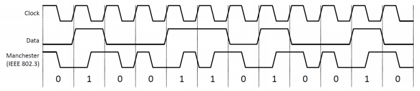

## Related Documentation

More details and code examples on the PIC16F13145 can be found at the following links:

- [PIC16F13145 Product Page](https://www.microchip.com/en-us/product/PIC16F13145?utm_source=GitHub&utm_medium=TextLink&utm_campaign=MCU8_MMTCha_PIC16F13145&utm_content=pic16f13145-manchester-decoder-mplab-mcc&utm_bu=MCU08)
- [PIC16F13145 Code Examples on Discover](https://mplab-discover.microchip.com/v2?dsl=PIC16F13145)
- [PIC16F13145 Code Examples on GitHub](https://github.com/microchip-pic-avr-examples/?q=PIC16F13145)
- [Manchester Encoder with Configurable Bitrate Based on CLB Using the PIC16F13145 Microcontroller with MCC Melody](https://github.com/microchip-pic-avr-examples/pic16f13145-cnano-manchester-encoder-mplab-mcc)
- [Manchester Encoder and Decoder - Use Cases for CIPs Using the AVR128DA48 Microcontroller with MCC Melody](https://github.com/microchip-pic-avr-examples/avr128da48-cnano-manchester-mplab-mcc)


## Software Used

- [MPLAB® X IDE v6.20 or newer](https://www.microchip.com/en-us/tools-resources/develop/mplab-x-ide?utm_source=GitHub&utm_medium=TextLink&utm_campaign=MCU8_MMTCha_PIC16F13145&utm_content=pic16f13145-manchester-decoder-mplab-mcc&utm_bu=MCU08)
- [MPLAB® XC8 v2.46 or newer](https://www.microchip.com/en-us/tools-resources/develop/mplab-xc-compilers?utm_source=GitHub&utm_medium=TextLink&utm_campaign=MCU8_MMTCha_PIC16F13145&utm_content=pic16f13145-manchester-decoder-mplab-mcc&utm_bu=MCU08)
- [PIC16F1xxxx_DFP v1.25.390 or newer](https://packs.download.microchip.com/)


## Hardware Used

- The [PIC16F13145 Curiosity Nano Development board](https://www.microchip.com/en-us/development-tool/EV06M52A?utm_source=GitHub&utm_medium=TextLink&utm_campaign=MCU8_MMTCha_PIC16F13145&utm_content=pic16f13145-manchester-decoder-mplab-mcc&utm_bu=MCU08) is used as a test platform:
    <br>


## Operation

To program the Curiosity Nano board with this MPLAB® X project, follow the steps provided in the [How to Program the Curiosity Nano Board](#how-to-program-the-curiosity-nano-board) chapter.<br><br>

## Concept

This project is a CIP implementation of a Manchester decoder with configurable bitrate. The CPU usage is limited as the decoding process is mostly performed by the CLB. The input data is decoded by the circuit composed into the CLB peripheral mentioned above and presented to the user via the serial terminal. The CLB circuit is captured in the figure below:

<br>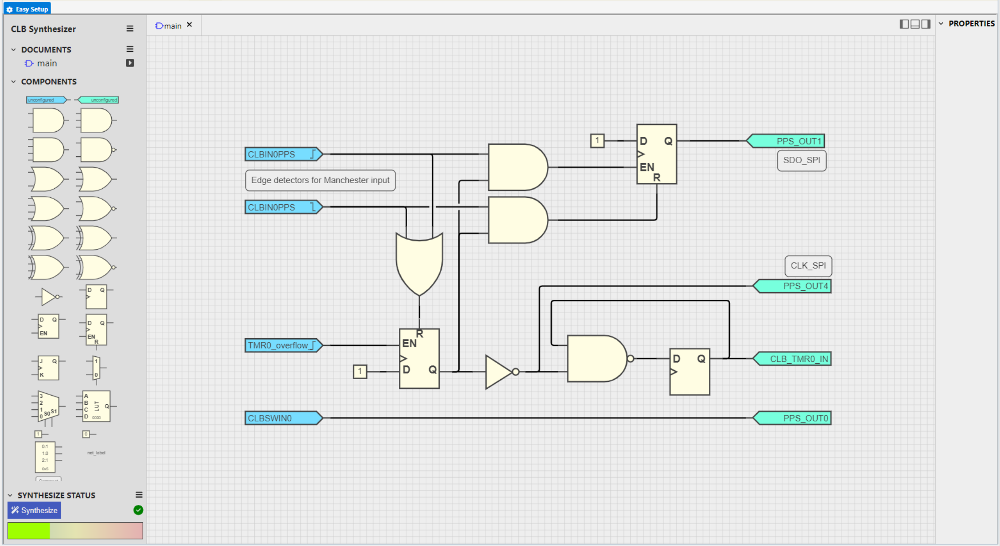

The current implementation uses the transitions that occur in the middle of each Manchester-encoded data bit (clock edges) to decode the incoming data stream. For a correct decoder synchronization, the first edge after an idle period must be a clock edge. This is ensured by the usage of start and stop bytes in the data frames (software protocol).
 
The encoded data is received through a wire on the RA2 pin. The rising and falling edges of the incoming signal are detected using CLB edge detectors. A validation time slot is created using a D flip-flop with enable and reset. The detected edges, combined through an OR gate, reset the flip-flop, while the TMR0 overflow, configured to 3/4 of the Manchester bitrate, sets the same flip-flop. By using this validation mechanism, only the clock edges are validated and used to generate the decoded data stream (SDO_SPI signal on PPS_OUT1) through two AND gates, as shown below:
- A rising edge that appears after 3/4 of the bit period will set the output flip-flop (logic `1`)
- A falling edge that appears after 3/4 of the bit period will reset the output flip-flop (logic `0`)
- Any edge that appears before 3/4 of the bit period is ignored

The decoded data stream is sent via the SPI interface to an SPI Client, MSSP1 in this case. The SPI data is the output of the flip-flop, while the validation window is used as the SPI clock. The decoded data is further transmitted via the serial communication (UART).
 
Note: The TMR0 overflow is proportional with the Manchester-encoded bitrate. To change the bitrate only the value of the `MANCHESTER_BAUD_RATE` macro must be updated, as for example:
 
`#define MANCHESTER_BAUD_RATE 625000`
 
## Setup 

The following peripheral and clock configurations are set up using the MPLAB® Code Configurator (MCC) Melody for the PIC16F13145:

1. Configuration Bits:
    - External Oscillator mode selection bits: Oscillator not enabled
    - Power-up default value for COSC bits: HFINTOSC (1 MHz)
    - Brown-out reset enable bits: Brown-out reset disabled
    - WDT operating mode: WDT Disabled, SEN is ignored
    <br>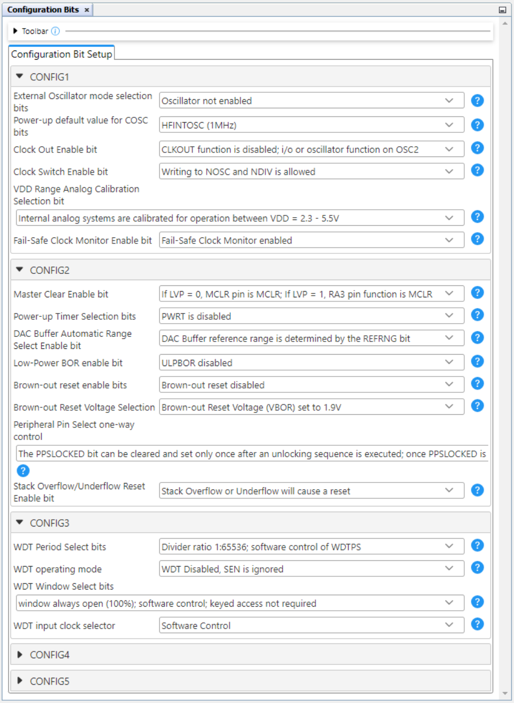

2. Clock Control:
    - Clock Source: HFINTOSC 
    - HF Internal Clock: 32_MHz
    - Clock Divider: 1
    <br>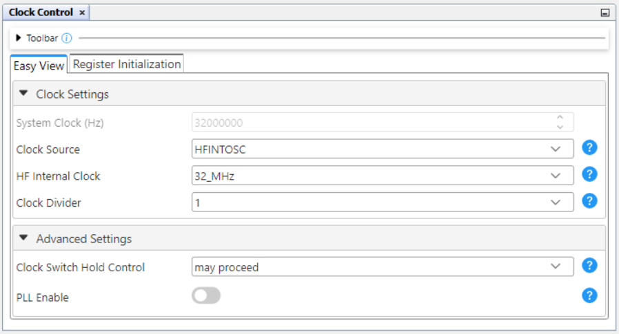

3. MSSP1 & SPI:
    - Serial Protocol: SPI
    - Enable Client Select: Enabled
    - Config Name: CLIENT_CONFIG
    - SPI Mode: SPI Mode 0
    - Interrupt Driven: Disabled
    <br>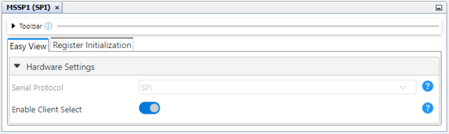
    <br>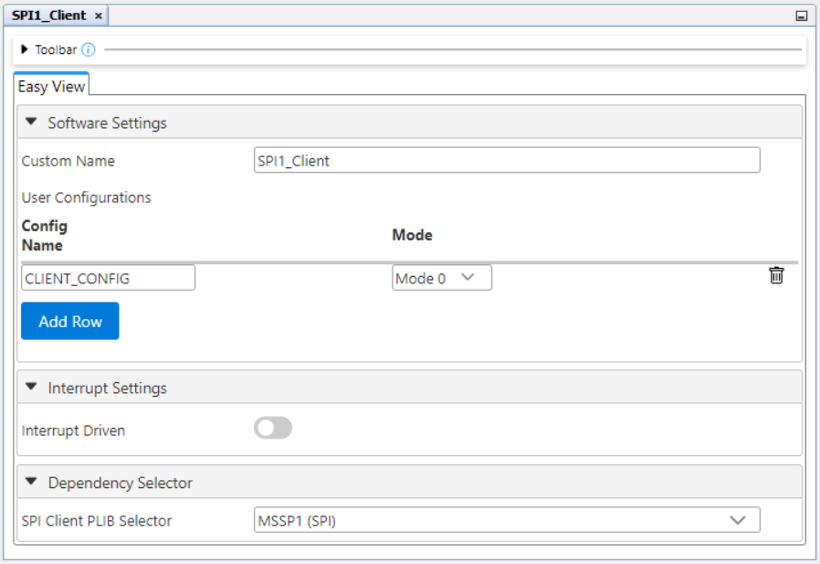

4. CLB:
    - Enable CLB: Enabled
    - Clock Selection: HFINTOSC
    - Clock Divider: Divide clock source by 2
    <br>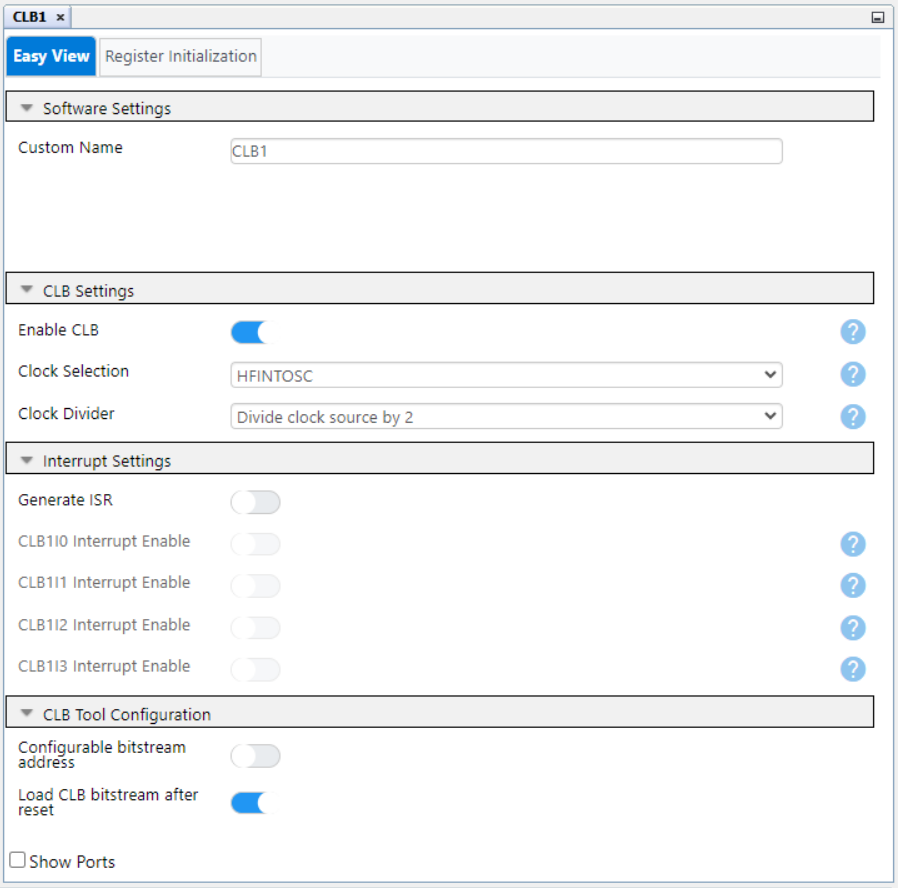 

5. CRC:
    - Auto-configured by CLB

6. NVM:
    - Auto-configured by CLB

7. UART1:
    - Requested Baudrate: 57600
    - Data Size: 8
    - Interrupt Driven: Disabled
    - Serial Port Enable: Enabled
    - Transmit Enabled: Enabled
    <br>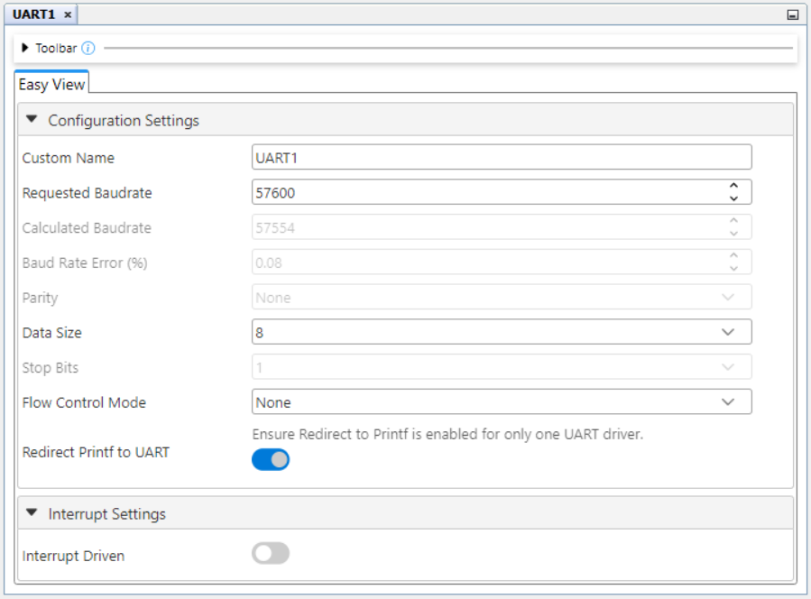
    <br>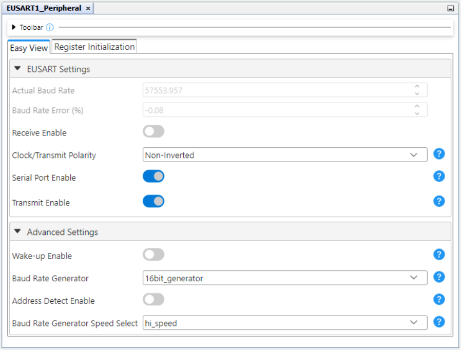 

8. TMR0:
    - Enable Timer: Enabled
    - Timer Mode: 8-bit
    - Clock Prescaler: 1:1
    - Postscaler: 1:1
    - Clock Source: CLB_BLE 
    - Clock Frequency(Hz): 8000000 Hz
    <br>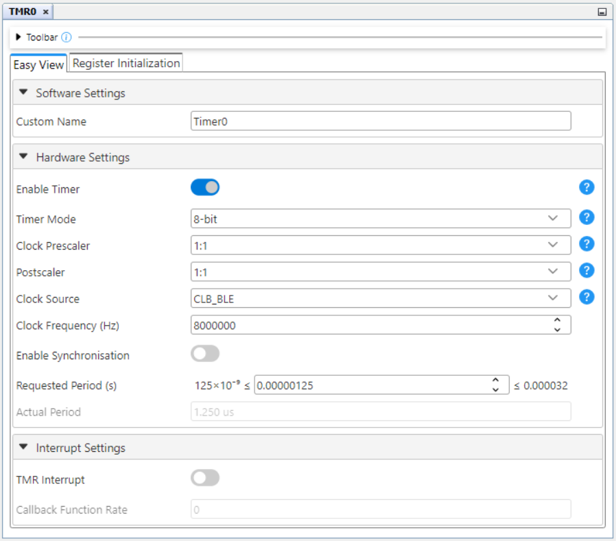

9. Pin Grid View:
    - EUSART1 TX1: RC4 (Data to the CDC terminal)
    - EUSART1 RX1: RC5 (Data from the CDC terminal)
    - CLBIN0PPS: RA2 (Encoded data from the encoder)
    - CLBPPSOUT0: RA4 (Client Select for SPI)
    - CLBPPSOUT1: RA5 (Data for SPI)
    - CLBPPSOUT4: RB4 (Clock fo SPI)
    - MSSP1 SS: RA4
    - MSSP1 SDI: RA5
    - MSSP1 SCK: RB4
    <br>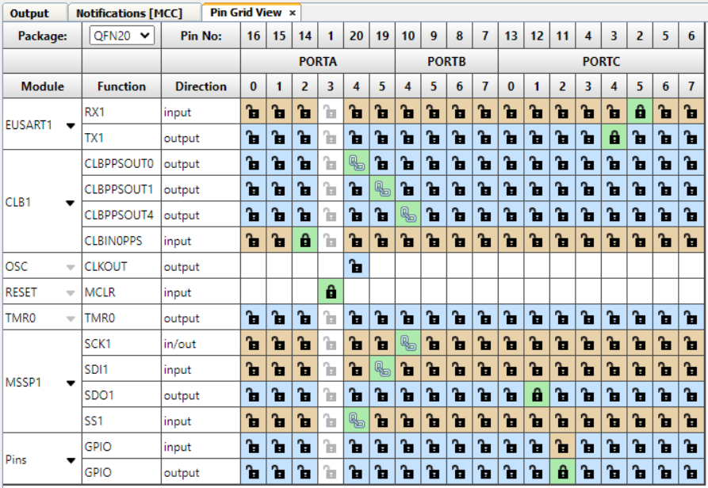

10. Pins:
    <br>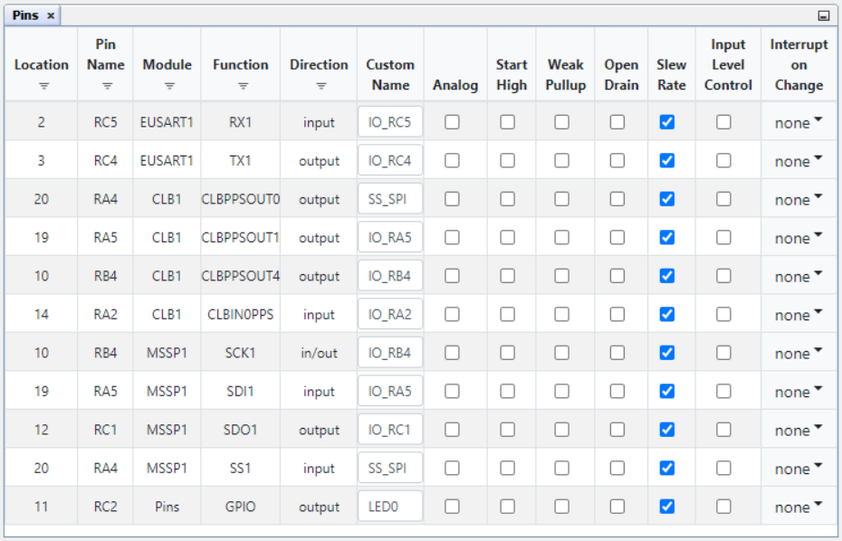


## Demo

In the demo, the Manchester-encoded messages received on the RA2 pin are decoded by the CLB logic and sent via the SPI interface (CLB is the SPI Host). The CPU reads the data from its SPI Client interface and forwards it to the serial terminal using the onboard UART interface.

If this example is used in combination with [PIC16F13145 Manchester Encoder](https://bitbucket.microchip.com/scm/mcu8npiapps/pic16f13145-cnano-manchester-encoder-mplab-mcc.git), the ```PIC16F13145 Manchester Encoder-Decoder\r\n``` message will appear periodically in the serial terminal. Note that both projects (Encoder and Decoder) must use the same bitrate, as for example: 

```#define MANCHESTER_BAUD_RATE 625000```

<br>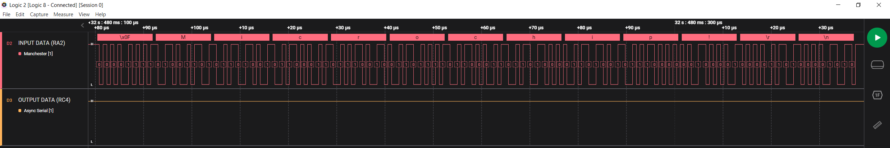
<br>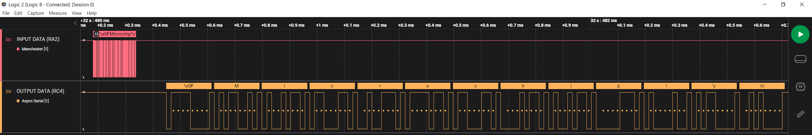
<br>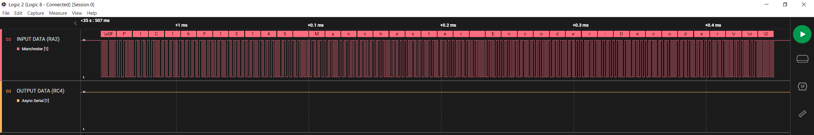
<br>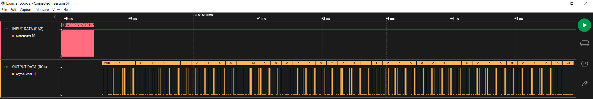

To use the embedded decoder from the Logic software, the following analyzers settings must be done:

<br>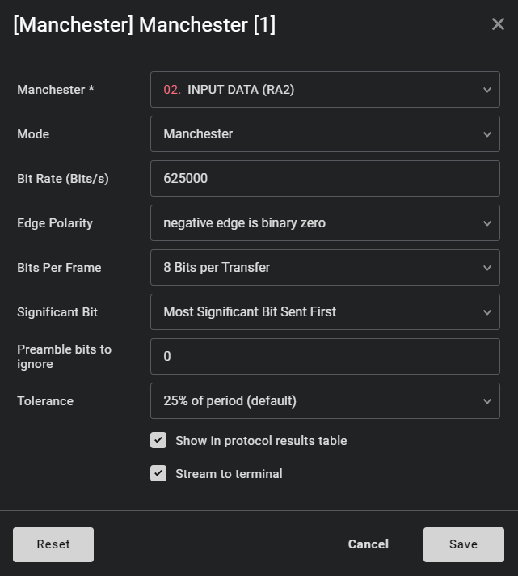

## Summary

This example demonstrates the capabilities of the CLB, a CIP, that can decode a Manchester-encoded message with minimal CPU intervention. The received data is then transmitted via EUSART and can be visualized in the serial terminal.

##  How to Program the Curiosity Nano Board 

This chapter demonstrates how to use the MPLAB® X IDE to program a PIC® device with an `Example_Project.X`. This is applicable to other projects.

1.  Connect the board to the PC.

2.  Open the `Example_Project.X` project in MPLAB X IDE.

3.  Set the `Example_Project.X` project as main project.
    <br>Right click the project in the **Projects** tab and click **Set as Main Project**.
    <br>

4.  Clean and build the `Example_Project.X` project.
    <br>Right click the `Example_Project.X` project and select **Clean and Build**.
    <br>

5.  Select PICxxxxx Curiosity Nano in the Connected Hardware Tool section of the project settings:
    <br>Right click the project and click **Properties**.
    <br>Click the arrow under the Connected Hardware Tool.
    <br>Select PICxxxxx Curiosity Nano by clicking on the SN.
    <br>Click **Apply** and then **OK**.
    <br>

6.  Program the project to the board.
    <br>Right click the project and click **Make and Program Device**.
    <br>

<br>

- - - 
## Menu
- [Back to Top](#manchester-decoder-with-configurable-bitrate-based-on-clb-using-the-pic16f13145-microcontroller-with-mcc-melody)
- [Back to Related Documentation](#related-documentation)
- [Back to Software Used](#software-used)
- [Back to Hardware Used](#hardware-used)
- [Back to Operation](#operation)
- [Back to Concept](#concept)
- [Back to Setup](#setup)
- [Back to Demo](#demo)
- [Back to Summary](#summary)
- [Back to How to Program the Curiosity Nano Board](#how-to-program-the-curiosity-nano-board)